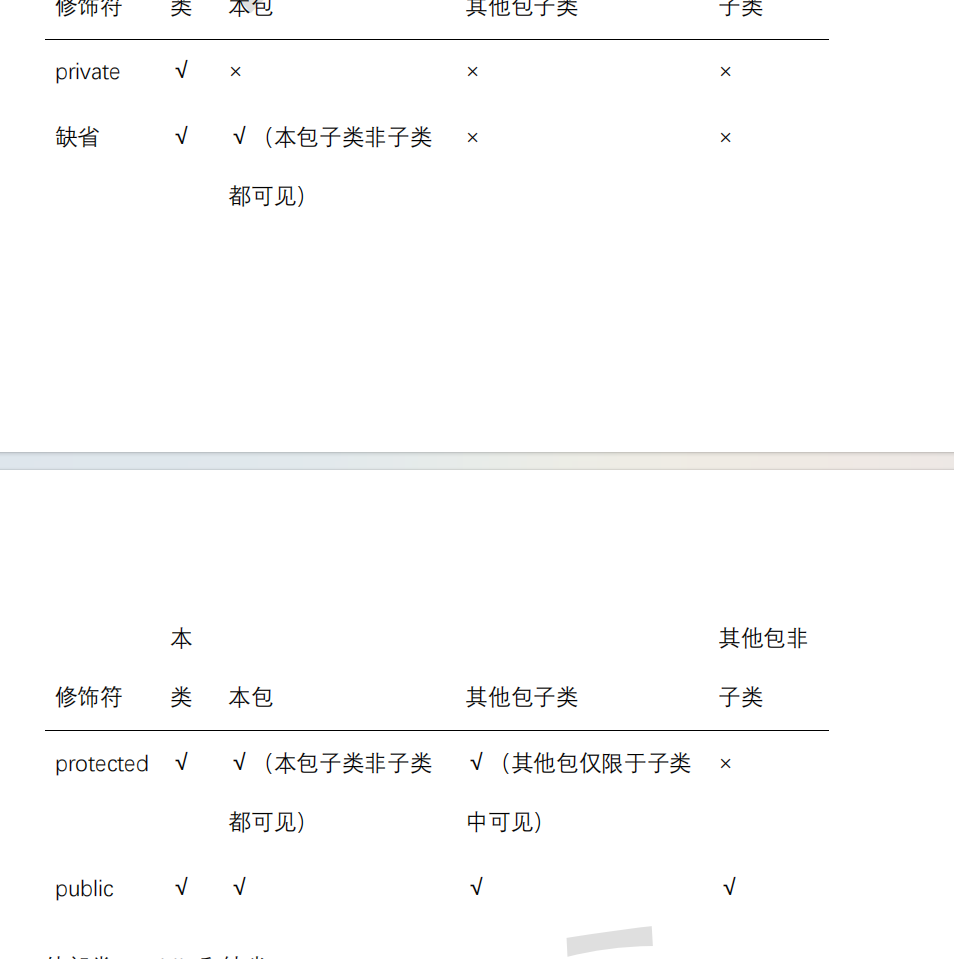

# 笔记

```
这个笔记主要记载较为杂碎的东西，脑子记不住
大O计数法相关联的知识
以前学过的大数据linux知识
	scp
	tar -zxvf
	kill -
	等等
回笼觉不能睡太久
联系刘伟
单词记忆
学一下java基础的
	反射
		了解即可
	继承
		深入
	元注解
		了解即可
	java面向对象全部重新看一遍
		    default void test (){
        		System.out.println("");
        	}
        	以上这段代码能看出没学好
```

## IDEA使用技巧

### 快捷键

1. ctrl+alt+<-  回到光标上一个位置
2. ctrl+alt+-> 回到光标上一个位置 
3. ctrl+n 搜索当前project的所有类，文件
4. idea界面左下角有个结构，点开可以查看当前类中的所有方法和属性
4. 查看一个类的子类可以在类或方法上点击ctrl+H
4. 查看一个抽象方法的实现方法可以点击ctrl+alt+b

### Maven

#### maven引入依赖找不到的问题

```
问题：Maven引入nacos的版本问题以及如何在阿里Maven仓库中找到想要的jar和Maven中的groupId、artifactId、version

报错日志：Could not find artifact org.springframework.cloud:spring-cloud-starter-alibaba-nacos-discovery:pom:unknown in alimaven (http://maven.aliyun.com/nexus/content/groups/public/)
```

[详情博客]: https://blog.csdn.net/BigCandidate/article/details/115526516

#### 更换maven源后找不到源仓库中已经存在的依赖

```
可能该工程是多模块项目，更新pom文件的模块依赖继承其他模块，需要在根模块执行maven install命令，更新maven源
```

## VsCode使用技巧

### 快捷键

1. alt+<- 回到光标上一个位置

### Vue中axios访问后端参数传递

```javascript
    //带查询条件的分页
    getHospsetPage(pageNum, size, searchObj) {
        return request({
            url: `${API}/${pageNum}/${size}`,
            method: 'post',
            //如果携带的是普通参数：params,如果携带的是json数据：data
            data: searchObj
        })
    },
```

### elementUi使用技巧

1. 拿到每一行的index----------scope.$index
2. 拿到每一行的数据-----------scope.$row

## Mysql

索引讲解

```
索引分为聚簇索引，非聚簇索引，唯一索引，联合索引，单列索引，联合索引底层就是多个单列索引
聚簇索引
	一般在建表设置主键时自动建立，基础B+树，子节点不存储数据，只存储key，页子节点存储主键对应的行数据
非聚簇索引
	子节点存储数据，但是只存储建立索引时候索引字段数据，需要二次查找
参考文章：https://www.cnblogs.com/jiawen010/p/11805241.html
```
### 常用情况以及一些导致索引失效原因

假设index(a,b,c)

| Where语句                                                | 索引是否被使用                                               |
| -------------------------------------------------------- | ------------------------------------------------------------ |
| where a = 3                                              | Y,使用到a                                                    |
| where a = 3 and b = 5                                    | Y,使用到a，b                                                 |
| where a = 3 and b = 5 and c = 4                          | Y,使用到a,b,c                                                |
| where b = 3 或者 where b = 3 and c = 4  或者 where c = 4 | N，根据最佳做前缀匹配原则，没使用到a，所以不能使用           |
| where a = 3 and c = 5                                    | 使用到a， 但是c不可以，b中间断了                             |
| where a = 3 and b > 4 and c = 5                          | 使用到a和b， c不能用在范围之后，b断了                        |
| where a is null and b is not null                        | is null 支持索引 但是is not null 不支持,所以 a 可以使用索引,但是  b不可以使用 |
| where a <> 3                                             | 不能使用索引，！=与<>不能使用索引                            |
| where abs(a) =3                                          | 不能使用 索引，函数不能使用索引                              |
| where a = 3 and b like 'kk%' and c = 4                   | Y,使用到a,b,c                                                |
| where a = 3 and b like '%kk' and c = 4                   | Y,只用到a，like '%'开头不能使用索引                          |
| where a = 3 and b like '%kk%' and c = 4                  | Y,只用到a                                                    |
| where a = 3 and b like 'k%kk%' and c = 4                 | Y,使用到a,b,c                                                |

### **一般性建议**

对于单键索引，尽量选择过滤性更好的索引（例如：手机号，邮件，身份证）

在选择组合索引的时候，过滤性最好的字段在索引字段顺序中，位置越靠前越好。

选择组合索引时，尽量包含where中更多字段的索引

组合索引出现范围查询时，尽量把这个字段放在索引次序的最后面

尽量避免造成索引失效的情

## Java

```
此为java后学学习阶段补充的知识点
```

### this关键字

1. this关键字不仅能调用成员变量，还能调用本类中的其他构造器this();表示调用本类中无参构造器,this(a,b)；调用有参构造器
2.  不能出现递归调用。比如，调用自身构造器。
3. this()和 this(实参列表)只能声明在构造器首行所以在类的一个构造器中，最多只能声明一个"this(参数列表)"

### 封装范围



### **super**

**在 Java 类中使用 super 来调用父类中的指定操作：**

1. super 可用于访问父类中定义的属性
2. super 可用于调用父类中定义的成员方法但是super 的追溯不仅 限于直接父类
3. super 可用于在子类构造器中调用父类的构造器
4. 尤其当子父类出现同名成员时，可以用 super 表明调用的是父类中的成员
5. super 和 this 的用法相像，this 代表本类对象的引用，super 代表父类的内存空间的标识
6. 阿里编程手册声明：**应该避免子类声明和父类重名的成员变量**
7. **子类构造器中调用父类构造器**
   1. 子类继承父类时，不会继承父类的构造器。只能通过“super(形参列表)”的方式调用父类指定的构造器。
   2.  规定：“super(形参列表)”，必须声明在构造器的首行。
   3. 我们前面讲过，在构造器的首行可以使用"this(形参列表)"，调用本类中重载的构造器，
   4. 在构造器的首行，"this(形参列表)" 和"super(形参列表)"只能二选一。
   5. 如果在子类构造器的首行既没有显示调用"this(形参列表)"，也没有显式调用"super(形参列表)"，则子类此构造器默认调用"super()"，即调用父类中空参的构造器。
   6. 得到结论：子类的任何一个构造器中，要么会调用本类中重载的构造器，要么会调用父类的构造器。只能是这两种情况之一。
   7. 如果子类构造器中既未显式调用父类或本类的构造器，且父类中又没有空参的构造器，则*编译出错*,java


### 接口

1. jdk1.8之后，接口中可以使用default和static关键字实现具体方法
   1. 接口的默认方法可以选择重写或不重写。如果有冲突问题，另行处理。
   2. 子类重写父接口的默认方法，要去掉default，子接口重写父接口的默认方法，不要去掉default
   3. 接口的静态方法不能被继承，也不能被重写。接口的静态方法只能通过“接口名.静态方法名”进行调用。
2. 但是当一个类实现俩个不同的接口，这俩个接口中包含包含同名方法，会抛出异常
3. Java 9接口定义私有方法
   1. 接口中private方法不能是**abstract**抽象方法。因为abstract抽象方法是公开的用于给接口实现类实现的方法，所以不能private。
   2. 接口中私有方法只能在接口内部的方法里面被调用。
   3. 接口中私有静态方法可以在其他静态和非静态接口方法中使用。
   4. 接口中私有非静态方法不能在私有静态方法内部使用。

### 注解

***框架* *=* *注解* *+* *反射* *+* *设计模式***


